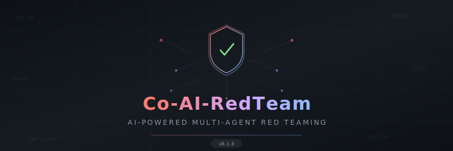
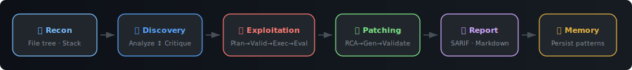

<div align="center">

<picture>
  <source media="(prefers-color-scheme: dark)" srcset="docs/banner.svg">
  <source media="(prefers-color-scheme: light)" srcset="docs/banner.svg">
  
</picture>

<br/>

[](https://github.com/Ak-cybe/Co-AI-RedTeam/actions)
[](https://python.org)
[](LICENSE)
[](https://github.com/astral-sh/ruff)

*Autonomous vulnerability discovery, exploitation, and patching using coordinated AI agents with execution-grounded reasoning.*

[Quickstart](#-quickstart) · [Architecture](#-architecture) · [Configuration](#-configuration) · [Memory System](#-memory-system) · [Contributing](#-contributing)

</div>

---

## 🎯 What is Co-AI-RedTeam?

**Co-AI-RedTeam** (CART) orchestrates seven specialized AI agents to perform end-to-end security assessments — from reconnaissance through exploitation to automated patch generation. Each agent operates under the principle of least privilege, and every exploit executes inside an isolated Docker sandbox.

Unlike traditional static analysis tools that pattern-match known signatures, CART reasons about vulnerability semantics, constructs evidence chains grounded in CWE/OWASP classifications, and refines its findings through an internal adversarial debate between Analysis and Critique agents before declaring a vulnerability confirmed.

<div align="center">



</div>

### Why CART?

| Feature | Traditional SAST | Generic AI Scanner | **Co-AI-RedTeam** |
|---------|:---:|:---:|:---:|
| Multi-agent analysis-critique loop | ❌ | ❌ | ✅ |
| Execution-grounded exploitation | ❌ | ❌ | ✅ |
| Automated patch generation with RCA | ❌ | Partial | ✅ |
| CWE/OWASP grounded reasoning | ✅ | Partial | ✅ |
| Evidence chain construction | ❌ | ❌ | ✅ |
| Cross-assessment memory | ❌ | ❌ | ✅ |
| SARIF + GitHub Code Scanning | ✅ | Partial | ✅ |
| Sandboxed exploit execution | N/A | ❌ | ✅ |

### When to Use CART

- **Pre-deployment security gates** — Run `cart scan` in CI/CD to catch vulnerabilities before they reach production
- **Codebase audits** — Assess an unfamiliar codebase for systemic vulnerability patterns across multiple CWE classes
- **Security research** — Investigate how multi-agent LLM systems reason about real-world vulnerability classes
- **Patch validation** — Generate and validate remediation patches with automated build and test verification

---

## 📚 Based on Research

CART implements techniques from two peer-reviewed papers:

- **[Co-RedTeam](https://arxiv.org/abs/2602.02164)** — *"Orchestrated Security Discovery and Exploitation with LLM Agents"* — Multi-agent framework with Analysis-Critique loop (Stage I) and Plan-Execute-Evaluate loop (Stage II)
- **[AIxCC SoK](https://arxiv.org/abs/2602.07666)** — *"SoK: DARPA's AI Cyber Challenge"* — CRS architectures for vulnerability discovery and patch generation with reflection-based retry

---

## 📋 Prerequisites

Before installing CART, ensure you have:

| Requirement | Details |
|-------------|---------|
| **Python** | 3.10 or higher ([download](https://python.org)) |
| **LLM API Key** | At least one: [Google Gemini](https://aistudio.google.com/apikey) (default), [OpenAI](https://platform.openai.com/api-keys), or [Anthropic](https://console.anthropic.com/) |
| **Docker** (optional) | Required for sandboxed exploit execution. Without it, CART falls back to local execution with a warning. |
| **OS** | Windows, macOS, Linux — tested on all three via CI (Ubuntu) |

---

## 🚀 Quickstart

### 30-Second Setup

```bash
# 1. Install
pip install co-ai-redteam

# 2. Set your API key (pick one)
export GEMINI_API_KEY="your-key"       # Google Gemini (default)
# export OPENAI_API_KEY="your-key"     # OpenAI
# export ANTHROPIC_API_KEY="your-key"  # Anthropic Claude

# 3. Scan
cart scan ./your-project
```

> **Windows users:** Use `set GEMINI_API_KEY=your-key` instead of `export`, or create a `.env` file (see below).

### Install from Source

```bash
git clone https://github.com/Ak-cybe/Co-AI-RedTeam.git
cd Co-AI-RedTeam
pip install -e ".[dev]"
```

### Environment File Setup

Instead of exporting environment variables, create a `.env` file in the project root:

```bash
cp .env.example .env
# Edit .env and add your API key
```

CART auto-loads `.env` via `python-dotenv` at startup.

### CLI Usage

```bash
# Full red team assessment
cart scan ./your-project

# Long-form alias
co-redteam scan ./your-project

# Discovery only — skip exploitation and patching
cart scan ./your-project --no-exploit --no-patch

# Report only Critical and High severity findings
cart scan ./your-project --severity high

# Guide analysis toward a specific area
cart scan ./your-project --hint "Check the authentication module for bypass"

# Use a specific model
cart scan ./your-project --model gpt-4o

# Custom output directory, no SARIF
cart scan ./your-project --output ./security-reports --no-sarif

# Disable Docker sandbox (use local execution)
cart scan ./your-project --no-sandbox

# Load configuration from file
cart scan ./your-project --config .co-redteam.yml

# Verbose output
cart scan ./your-project -v
```

### Example Output

<div align="center">



</div>

> **Note:** The output above is illustrative. Actual results depend on the target codebase and LLM provider.

### What Happens Next

After a scan completes, CART saves results to the output directory (default: `reports/`):

- **`assessment_report.md`** — Executive-ready Markdown report with severity breakdowns, evidence chains, remediation guidance, and patch diffs
- **`findings.sarif`** — SARIF v2.1.0 file compatible with [GitHub Code Scanning](https://docs.github.com/en/code-security/code-scanning), including code flow traces and fix suggestions

The CLI exits with code `1` if vulnerabilities are found and `0` otherwise, making it suitable for CI/CD gate checks.

---

## 🏗️ Architecture

### Multi-Agent System

CART coordinates seven specialized agents through a central orchestrator that manages pipeline flow, agent lifecycle, and state transitions:

<div align="center">


</div>

### Data Flow

Source code enters the pipeline during Reconnaissance, where CART builds a file tree and detects the tech stack. The Analysis Agent receives the code context and produces vulnerability drafts with CWE classifications. The Critique Agent independently evaluates each draft's evidence quality, filtering false positives across up to 3 rounds. Approved findings flow into Exploitation, where the Planner creates step-by-step strategies that the Validator checks for safety before the Executor runs them inside Docker. The Evaluator assesses results and feeds deviations back to the Planner for up to 20 iterations. Confirmed vulnerabilities then enter the Patching phase, where root cause analysis drives code generation through a reflect-retry loop (up to 5 attempts). Finally, SARIF and Markdown reports are generated, and successful patterns are stored in the 3-layer memory system for future scans.

### Role-Aware Tool Assignment

Each agent is granted **only the tools it needs** (principle of least privilege), enforced via `ROLE_TOOL_MAP` in `agents/base.py`:

| Agent | Code Browse | Vuln Docs | Memory Read | Execute | Code Edit | Build/Test | Safety Check |
|-------|:---:|:---:|:---:|:---:|:---:|:---:|:---:|
| Analysis | ✅ | ✅ | ✅ | ❌ | ❌ | ❌ | ❌ |
| Critique | ✅ | ✅ | ❌ | ❌ | ❌ | ❌ | ❌ |
| Planner | ✅ | ✅ | ✅ | ❌ | ❌ | ❌ | ❌ |
| Validator | ❌ | ❌ | ❌ | ❌ | ❌ | ❌ | ✅ |
| Executor | ❌ | ❌ | ❌ | ✅ | ❌ | ❌ | ❌ |
| Evaluator | ❌ | ❌ | ❌ | ❌ | ❌ | ❌ | ✅ |
| Patcher | ✅ | ❌ | ❌ | ❌ | ✅ | ✅ | ❌ |

> The Executor has `run_bash` + `run_python`. The Patcher has `code_edit` + `build` + `test` + `code_browse`. The Evaluator has `syntax_check` for output validation. Full definitions in [`agents/base.py`](src/co_redteam/agents/base.py).

### Key Innovations

1. **Analysis-Critique Loop** — Internal adversarial debate between specialized agents eliminates false positives across up to 3 rounds
2. **Explicit Exploit Plans** — Inspectable, revisable step-by-step exploitation strategies with per-step status tracking
3. **Execution-Grounded Reasoning** — Real sandbox output drives plan revision, not hallucination
4. **Validator Gate** — Safety and syntax checks between planning and execution prevent dangerous or malformed commands
5. **3-Layer Memory** — Patterns (what), Strategies (how), Actions (concrete commands) persist across assessments and improve subsequent scans
6. **Reflection-Based Patching** — Failed patches inform subsequent attempts via the AIxCC RCA → Generate → Validate loop

---

## ⚙️ Configuration

### Generate a Config File

```bash
cart init ./my-project
```

This creates `.co-redteam.yml` with all available options:

```yaml
target_path: ./my-project
scope: full                         # Options: full, delta, file, directory

llm:
  provider: gemini                  # Options: gemini, openai, anthropic, ollama
  model: gemini-2.5-pro             # Model name for chosen provider
  temperature: 0.1                  # Lower = more deterministic (0.0–2.0)
  max_tokens: 8192                  # Max output tokens per LLM call (256–65536)

discovery:
  max_critique_iterations: 3        # Analysis-Critique debate rounds (1–10)
  min_confidence: 0.6               # Minimum confidence to accept a finding (0.0–1.0)
  min_severity: low                 # Floor: critical, high, medium, low, informational
  max_files_per_scan: 500           # Cap on files ingested (1–5000)

exploit:
  enabled: true                     # Set false to skip exploitation entirely
  max_iterations: 20                # Plan-Execute-Evaluate loop budget (1–50)
  require_validation: true          # Enforce Validator gate before execution
  sandbox_execution: true           # Run exploits inside Docker

patch:
  enabled: true                     # Set false to skip patching
  max_retry_attempts: 5             # RCA → Generate → Validate retries (1–10)
  run_build_check: true             # Verify patched code builds
  run_test_suite: true              # Run project tests after patching
  minimal_diff: true                # Prefer smallest possible code change

sandbox:
  enabled: true                     # Docker sandbox for exploit execution
  image: "python:3.12-slim"         # Docker image for sandbox containers
  timeout_seconds: 60               # Per-command timeout (5–600)
  memory_limit: "512m"              # Container memory limit
  network_disabled: false           # Isolate container from network

memory:
  enabled: true                     # Persist patterns across scans
  storage_dir: .cart_memory         # Where to store memory JSON files

report:
  output_dir: reports               # Directory for generated reports
  generate_sarif: true              # SARIF v2.1.0 for GitHub Code Scanning
  generate_markdown: true           # Executive-ready Markdown report
  include_poc_code: true            # Include exploit PoC in reports
  include_patches: true             # Include generated patches in reports
```

### Common Configuration Patterns

**CI/CD Mode** — Fast discovery, no exploitation, SARIF output for GitHub:

```yaml
scope: full
exploit:
  enabled: false
patch:
  enabled: false
discovery:
  min_severity: high
  max_critique_iterations: 2
report:
  generate_sarif: true
  generate_markdown: false
```

**Deep Assessment** — Thorough analysis with full exploitation and patching:

```yaml
scope: full
discovery:
  max_critique_iterations: 5
  min_confidence: 0.5
  min_severity: low
exploit:
  max_iterations: 30
patch:
  max_retry_attempts: 8
memory:
  enabled: true
```

**Python-Only Discovery** — Targeted scan with specific guidance:

```bash
cart scan ./src --severity medium --hint "Focus on SQL injection and command injection" --no-exploit
```

### Python API

```python
import asyncio
from co_redteam import Orchestrator, RedTeamConfig

async def main():
    config = RedTeamConfig(target_path="./vulnerable-app")
    orchestrator = Orchestrator(config)
    result = await orchestrator.run()

    print(f"Found {result['vulnerabilities_found']} vulnerabilities")
    print(f"Generated {result['patches_generated']} patches")

asyncio.run(main())
```

---

## 🧠 Memory System

CART implements the Co-RedTeam paper's 3-layer long-term memory, persisted as JSON files across assessments:

### Layer 1: Vulnerability Patterns

**What gets stored:** Confirmed vulnerability templates — CWE class, symptoms, hypothesis, confirming test, false leads to avoid.

**When retrieved:** At the start of Discovery, the Analysis Agent receives relevant patterns for the detected tech stack, priming it with known vulnerability shapes.

**Example:** After finding a SQL injection via f-string interpolation in a Flask app, CART stores a `VP-001` pattern. On subsequent Flask scans, the Analysis Agent retrieves this pattern and checks for the same anti-pattern proactively.

### Layer 2: Strategies

**What gets stored:** High-level exploitation workflows — approach, preconditions, success criteria, failure cases, and which vulnerability classes they transfer to.

**When retrieved:** During Exploitation, the Planner Agent queries strategies by vulnerability class to inform plan construction.

**Example:** A successful time-based blind SQL injection strategy (inject `SLEEP`, measure response delta) is stored as `ST-001`. When the next SQL injection is found, the Planner retrieves this strategy instead of reasoning from scratch.

### Layer 3: Technical Actions

**What gets stored:** Concrete commands and code snippets that succeeded or failed — with prerequisites and related pattern references.

**Example:** The exact `curl` command that confirmed an SSRF vulnerability gets stored as `TA-001`, linked back to its parent pattern.

### Memory Lifecycle

```
Scan → Discover vulns → Exploit → Patch → Extract learnings → Store
                                                                 │
Next Scan ← Retrieve relevant patterns ← Query by CWE/tech ─────┘
```

### Memory CLI

```bash
# View memory statistics
cart memory stats

# List stored items (all layers or filtered)
cart memory list
cart memory list --layer patterns
cart memory list --layer strategies
cart memory list --layer actions

# Query patterns by CWE identifier
cart memory query CWE-89
```

---

## 🔄 CI/CD Integration

### GitHub Actions

```yaml
# .github/workflows/security.yml
name: Security Scan

on:
  pull_request:
    branches: [main]

jobs:
  cart-scan:
    runs-on: ubuntu-latest
    steps:
      - uses: actions/checkout@v4

      - name: Set up Python
        uses: actions/setup-python@v5
        with:
          python-version: "3.12"

      - name: Install CART
        run: pip install co-ai-redteam

      - name: Run Security Scan
        env:
          GEMINI_API_KEY: ${{ secrets.GEMINI_API_KEY }}
        run: cart scan . --severity high --no-exploit --no-patch --output reports/

      - name: Upload SARIF to GitHub Code Scanning
        if: always()
        uses: github/codeql-action/upload-sarif@v3
        with:
          sarif_file: reports/findings.sarif
```

### GitLab CI

```yaml
# .gitlab-ci.yml
security-scan:
  image: python:3.12-slim
  stage: test
  variables:
    GEMINI_API_KEY: $GEMINI_API_KEY
  script:
    - pip install co-ai-redteam
    - cart scan . --severity high --no-exploit --no-patch --output reports/
  artifacts:
    paths:
      - reports/
    reports:
      sast: reports/findings.sarif
  allow_failure: true
```

### Reading SARIF Results

When you upload `findings.sarif` via the `github/codeql-action/upload-sarif` action, findings appear in your repository's **Security → Code Scanning** tab. Each finding includes:

- The vulnerability location (file, line, column)
- CWE classification and severity level
- Evidence chain and reasoning from the Analysis-Critique loop
- Suggested remediation with patch diffs (when patching is enabled)

---

## 🤝 Contributing

We welcome contributions! See [CONTRIBUTING.md](CONTRIBUTING.md) for the full guide.

### Development Setup in 60 Seconds

```bash
git clone https://github.com/Ak-cybe/Co-AI-RedTeam.git
cd Co-AI-RedTeam
python -m venv .venv
.venv\Scripts\activate        # Windows
# source .venv/bin/activate   # Linux/Mac
pip install -e ".[dev]"

# Verify everything works
pytest tests/ -v              # 47 tests across 4 files
ruff check src/ tests/        # Lint
mypy src/co_redteam/ --ignore-missing-imports  # Type check
```

### Priority Areas

- 🧪 Agent prompt engineering improvements
- 🐛 False positive reduction in critique agent
- 🔌 Additional LLM provider support (Ollama local models)
- 📊 Enhanced SARIF code flow generation
- 🧠 Embedding-based memory retrieval (currently file-globbing by CWE)
- 🐳 Pre-built Docker sandbox images for common tech stacks

### Project Structure

```
co-ai-redteam/
├── src/co_redteam/
│   ├── agents/            # 7 specialized AI agents
│   │   ├── base.py        # Base class + ROLE_TOOL_MAP
│   │   ├── analysis.py    # Vulnerability discovery
│   │   ├── critique.py    # Evidence validation
│   │   ├── planner.py     # Exploit planning
│   │   ├── validator.py   # Safety + syntax gate
│   │   ├── executor.py    # Sandboxed execution
│   │   ├── evaluator.py   # Execution assessment
│   │   └── patcher.py     # Patch generation
│   ├── memory/            # 3-layer experience storage
│   │   ├── schemas.py     # Pydantic models for all 3 layers
│   │   └── store.py       # JSON persistence + CWE querying
│   ├── reporting/         # Output generators
│   │   ├── sarif.py       # SARIF v2.1.0
│   │   └── markdown.py    # Executive reports
│   ├── cli.py             # Click-based CLI (cart / co-redteam)
│   ├── config.py          # Pydantic configuration models
│   └── orchestrator.py    # Central 6-phase pipeline
├── tests/                 # 47 tests across 4 files
│   ├── test_agents.py     # Agent roles, permissions, planning
│   ├── test_config.py     # Configuration validation
│   ├── test_memory.py     # Memory persistence, counter resilience
│   └── test_reporting.py  # SARIF + Markdown generation
└── .github/workflows/     # CI (lint, test, security) + Release
```

---

## ⚠️ Responsible Use

Co-AI-RedTeam is designed for **authorized security testing only**.

- ✅ Test your own codebases and applications
- ✅ Run assessments with proper authorization
- ✅ Use in CI/CD pipelines for automated security checks
- ❌ Do NOT use against systems without explicit permission
- ❌ Do NOT use for offensive operations against unauthorized targets

All exploitation occurs within **ephemeral Docker containers** that are destroyed after each run (`remove_after: true` by default). When Docker is unavailable, CART logs a prominent warning before falling back to local execution.

---

## 📜 License

[Apache 2.0](LICENSE) — Free for commercial and personal use.

---

## 📊 Project Status

| Component | Status |
|-----------|--------|
| Core Orchestrator (6-phase pipeline) | ✅ Complete |
| Analysis Agent (CWE-grounded discovery) | ✅ Complete |
| Critique Agent (false positive filtering) | ✅ Complete |
| Planner Agent (explicit exploit plans) | ✅ Complete |
| Validator Agent (safety + syntax gate) | ✅ Complete |
| Executor Agent (Docker sandbox) | ✅ Complete |
| Evaluator Agent (deviation detection) | ✅ Complete |
| Patcher Agent (RCA → reflect → retry) | ✅ Complete |
| 3-Layer Memory System | ✅ Complete |
| SARIF v2.1.0 Reports | ✅ Complete |
| Markdown Reports | ✅ Complete |
| CLI (`cart` / `co-redteam`) | ✅ Complete |
| CI/CD Pipeline (lint, test, security, release) | ✅ Complete |
| Docker Sandbox | ✅ Complete |
| Test Suite (47 tests, 4 files) | ✅ Complete |

---

<div align="center">

**Built with ❤️ using [Co-RedTeam](https://arxiv.org/abs/2602.02164) & [AIxCC](https://arxiv.org/abs/2602.07666) research**

⭐ Star this repo if you find it useful!

</div>
